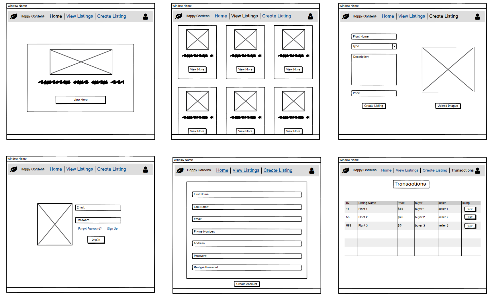

Access Happy Gardens [here](https://happy-gardens.herokuapp.com/)  
Github Repo can be found [here](https://github.com/ehall28/happy-gardens)

---
## Description

Happy Gardens is a two-way marketplace application where users can browse various listings of plants. If the user wishes to either purchase something or create a listing of their own, they will need to sign up beforehand. Happy Gardens is designed to help individuals find the right plant, while ensuring top service and reasonable prices.

### Identification of the problem you are trying to solve by building this particular marketplace app and why is it a problem that needs solving?

There are a few problems in the online plant industry that Happy Gardens hopes to solve. Most online websites that sell plants, sell them for an exorbitant price and don't offer after service plant care. Happy Gardens allows users to sell their plants at a reasonable price, while also ensuring customer/buyer satisfaction knowing that they are receiving the best deal. Happy Gardens will also provide after service care/tips for anyone that needs a hand after buying their desired plant. Happy Gardens also removes the cost of delivery, as most other online plant website charge a great deal for delivery. Another problem that needs solving is that there aren't any places that offer a service for plant cuttings. Through Happy Gardens, anyone can upload an image of their garden and allow for people to make requests of a specific cutting from a specific plant within their garden, which Happy Gardens can also offer the service of ensuring that the cutting is taken from the plant correctly and planted correctly, giving the cutting the best chance to flourish for the customer. One last problem that most plant shops don't offer is plant health guarantees, to combat this, Happy Gardens will offer a 6 month plant health guarantee to all customers, ensuring returning clients and happy customers.

### Purpose
The purpose of this two-way marketplace is to provide a service for like minded individuals to purchase plants and cuttings with ease, while also ensuring product quality and buyer/seller satisfaction. With the added bonus of after plant care, the customers are guaranteed the best experience. Happy Gardens aims to disrupt the problems within the online plant buying community and add a new convenient way to shop for plants online.     

---
#### Target audience

- The target audience is anyone of any age that has an interest in plants and gardening, is looking to get into gardening or are even looking for a gift for someone else.

---
### Functionality / features

- The application is created using Ruby on Rails, which has been deployed to Heroku.
- The Devise gem was implemented to allow users to sign up, log in and out, as well as edit their account details or delete their account. Devise also handles prompting the user if the entered user name or password is incorrect and also aids the user in resetting the password if needed.  
- To ensure users were restricted to seeing certain pages, the Pundit gem was implemented. Pundit allows the implementation of a policy and the assignment of roles to users. All new users are automatically assigned the role of user, which grants access to the website and the ability to create listings.
- Image upload capability was handle by Cloudinary, which allowed sellers to upload images of the plant they wished to sell. Cloudinary also offers editing capabilities that allow you to scale and edit photos without the need of CSS.
- Users that hold an account are able to create, edit, view and delete their listings. Users that do not own the listing they are viewing, will not be authorised to edit or delete that listing, nor will the options be displayed to them.

---
### Sitemap

The below sitemap demonstrates the general flow of the application. The root page is the home page, which will be the first page upon loading into Happy Gardens. From the homepage, users can traverse to the view listings page and can then click on any listing to see further details. The user will also need to sign up or log in first to access the create listing tab.

  
---
### Tech stack (e.g. html, css, deployment platform, etc)
- Ruby on Rails
- HTML
- CSS
- Bootstrap
- Cloudinary - Image Upload
- Devise - Authentication
- Rolify - Authorization
- Pundit - Policies and User Roles
- Heroku - Website deployment
- SQLite - Database used for development
- PostgreSQL - Database used for production

---
## User stories

- As a user I want to view listings without an account so I can browse the website first before signing up
- As a user I want to register/sign up to the application by entering my email, password and other details so I can create a plant sale listing or buy a plant
- As a user I want to log into the application using my email so I can view my account details to make sure it is correct
- As a user I want to be able to reset my password so I can still log in if my password is forgotten
- As a user I want to log into the application using my email so I can view my transaction history so I can view invoices
- As a user I want to log into the application using my email so I can edit my account to update any details
- As a user I want to log into the application using my email so I can delete my account so I can stop using the application 
- As a user I want to log into the application using my email to add a listing so I can sell my plants
- As a user I want to log into the application using my email to view the listings so I can buy plants
- As a user I want to log into the application using my email to edit my listings so I can update the plant details
- As a user I want to log into the application using my email to delete my listing so I can remove it from the website

---
## Wireframes

---

---

---
## ERD
    -  Discuss the database relations to be implemented
    -  Provides coherent discussion of the database relations, with reference to the ERD

    - ERD provided represents a normalised database model

## Explain the different high-level components (abstractions) in your app
    - High level abstractions - describe each model/entities and how they relate to each other and the purpose of having them in the app

- The user model is handled by the devise gem
    - gives the ability to log in
    - the views are handle by the devise gem which allows a user to log in, sign up and change their details
- listing
    - stores information about the item being sold through the website
- transaction 
    - stores information about the purchases made

Abstractions are basically your models, views and controllers
Explain how the MVC architecture and concept of inheritance impact the structure of your application and the entities within it

---
## Third party services that your app will use
    - Includes a complete and detailed description of third party services used in the app

- cloudinary - is a cloud based image and video storing service. It allows users to upload and store images to the cloud, once uploaded, the images can be manged and organised into folders or however you desire. Cloudinary offers the 
- heroku 

## Describe your projects models in terms of the relationships (active record associations) they have with each other
    - Complete discussion of the project’s models with an understanding of how its active record associations function

In terms of active record associations - belongs_to, through, has_many -relationships of the models in terms of active record
-eg if you have a has_many through, what does that mean? why is it needed to achieve that purpose?

- Listing belongs_to the user
    - because we need the one-to-one connection, so each listing can be assigned directly to one user.
    - Having this association allows us to limit what a user can see or access. Without a certain listing belonging to a user, anyone would be able to make changes to it and potentially delete it or provide misinformation.
- Listing has_one_attached image
    - 
- A user has_many listings
    - 

- The Role model was pregenerated- but has the relation has_and_belongs_to users

## Discuss the database relations to be implemented in your application

 Table relationships - language of databases - narrative explanation of ERD R12 - R12 is the visual aspect 

A user of Happy Gardens has a one-to-many listing relation, as a user can have multiple listings, but only one listing can belong to a user. In the listings table, a seller_id was included as a foreign key to identify the relationship between the users table and listings table. The listing also has a one-to-one relation with images, because in the listing model there is a has_one_attached image relation. 

- The users table contains a autoincrementing, unique id set as the primary key, which helps to distinguish the users apart
- Each listing also has a unique id set as the primary key, but also contains a seller_id listed as the foreign key, which connects to the specific users id - this is ensures that we'll always know what listing belongs to who - makes authorisation easier
- The transaction table contains both a buyer and seller id as foreign keys, as well as a listing id which connects to a specific listing. This allows us to determine who purchased what and who the original listing belonged to.  

## Database schema design

---
## Describe the way tasks are allocated and tracked in your project

    - Shows significant planning for how tasks are planned and tracked, including a full description of the process and of the tools used

The project was tracked using the list making application, trello (link can be found [here](https://trello.com/b/Wjpd4G0L/two-way-marketplace)). The tasks were broken down into categories to better help identify what was currently being worked on and what took priority over other tasks. Some larger tasks were split up into checklists to help break down what the was required in implementing a task. Such as, for my view task, I add various checklist to help identify which tasks to tackle first 

- you need to implement something first before another thing ie models before views etc - thats why its structured that way also 

